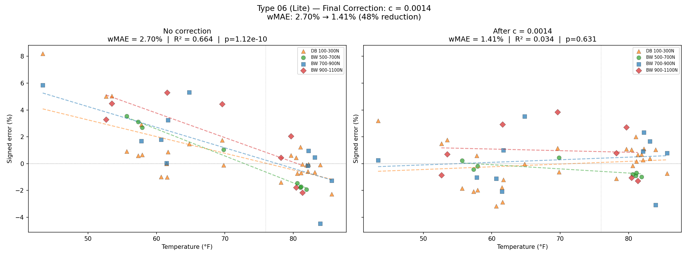
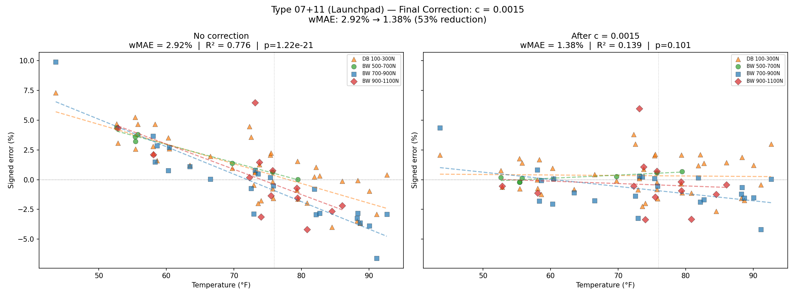
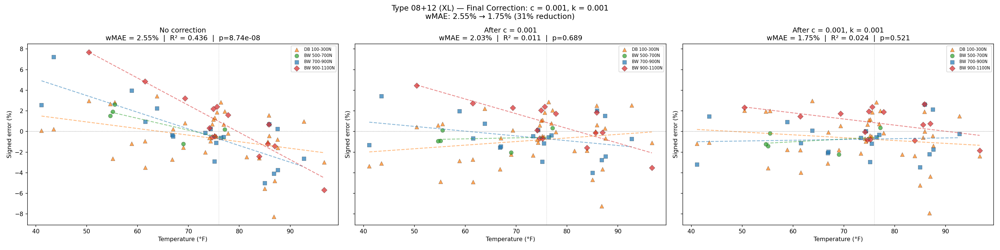

# Informe de Investigación del Coeficiente de Temperatura

## El Problema

Las plataformas de fuerza miden con menor precisión a medida que la temperatura se aleja de la temperatura ambiente (~76°F). A temperaturas frías, las lecturas se desvían hacia arriba. A temperaturas altas, se desvían hacia abajo. Cuanto más lejos de la temperatura ambiente, peor es el resultado.

Sin corrección, una plataforma que es precisa a ±1% a 76°F podría tener un error de 3-5% a 45°F o 90°F. Este es un efecto térmico a nivel de hardware en los sensores de galga extensométrica.

## Lo Que Aprendimos Sobre las Plataformas

### La deriva térmica es lineal y consistente

Para todos los tipos de plataformas, la relación entre temperatura y error es aproximadamente lineal. Una plataforma a 56°F (20° por debajo de la temperatura ambiente) se desvía aproximadamente el doble que una a 66°F (10° por debajo). Esto significa que una corrección proporcional simple funciona — no se necesitan tablas de búsqueda ni curvas polinómicas.

### La deriva es similar entre plataformas del mismo tipo

Dentro de un tipo de plataforma, diferentes unidades individuales muestran tasas de deriva térmica muy similares. Las plataformas Tipo 06 (excluyendo una unidad dañada) tuvieron tasas de deriva de 0.001304-0.001430 — un grupo compacto. Esto significa que podemos usar un único valor de corrección por tipo de plataforma en lugar de calibrar cada plataforma individualmente.

### Las plataformas XL tienen un componente dependiente de la fuerza

Para las plataformas Lite (06) y Launchpad (07+11), la deriva térmica afecta a todas las fuerzas por igual — una medición de mancuerna de 200N y una medición de peso corporal de 1000N se desvían en el mismo porcentaje a la misma temperatura. Pero para las plataformas XL (08+12), las cargas más pesadas se desvían más que las ligeras. Esto significa que las plataformas XL necesitan un segundo término de corrección que tenga en cuenta la fuerza.

### Plataformas de generación anterior vs nueva generación

Las plataformas más antiguas (Tipo 07, Tipo 08) tienen sensores de temperatura menos precisos que registran ~3-4°F de más. Esto no rompe la corrección (el modelo fue entrenado con el mismo sensor), pero significa que las plataformas antiguas responden de manera ligeramente diferente a los valores de corrección optimizados para las plataformas más nuevas. En la práctica, usar los valores óptimos de las plataformas nuevas en las antiguas sigue ayudando — solo que no tanto.

### Plataformas excluidas y señaladas

Dos plataformas fueron excluidas del análisis por completo, y una fue señalada como un caso atípico de generación anterior. Para verificar estas decisiones, revisamos el rendimiento de cada plataforma a temperatura ambiente (71-81°F), donde la corrección de temperatura no tiene efecto. Si una plataforma tiene un mal rendimiento a temperatura ambiente, el problema no es térmico — la plataforma en sí está dañada o mal calibrada.

| Plataforma | EAM Temp. Ambiente | Otras Plataformas (mismo tipo) EAM Temp. Ambiente | Ratio | Estado |
|---|---|---|---|---|
| **06.00000025** | 5.31% | 1.23% | **4.3x peor** | Excluida — dañada |
| **08.00000038** | 12.34% | 1.08% | **11.4x peor** | Excluida — dañada |
| **07.00000051** | 1.85% | 1.46% | 1.3x peor | Incluida — sensor de gen. anterior |

- **06.00000025**: Más de 4x peor que otras plataformas Lite a temperatura ambiente. Esta plataforma tiene un problema fundamental de precisión no relacionado con la temperatura. La corrección de temperatura no puede ayudar — los errores no son de origen térmico (R² cercano a cero en regresión). Excluida de todo el análisis y optimización del Tipo 06.

- **08.00000038**: Más de 11x peor que otras plataformas XL a temperatura ambiente. Con un 12.34% de error promedio incluso en condiciones ideales, esta plataforma está claramente dañada o severamente mal calibrada. La corrección la empeora. Excluida de todo el análisis del Tipo 08+12.

- **07.00000051**: Solo 1.3x peor que las plataformas Tipo 11 a temperatura ambiente — dentro del rango aceptable. La diferencia se amplía a temperaturas extremas (EAM total 3.23% vs 2.11%) porque el sensor de temperatura de generación anterior registra ~3-4°F de más, haciendo que la corrección c sea ligeramente incorrecta. Esta plataforma es funcional pero tiene un sensor menos preciso. Está **incluida** en el análisis final 07+11 y en los valores de producción. El valor c=0.0015 fue optimizado para las cuatro plataformas Tipo 11 (que logran R²=0.001, p=0.90 — esencialmente una decorrelación perfecta de temperatura). La plataforma 07 recibe el mismo c y tiene un rendimiento adecuado (1.85% a temp. ambiente, 2.42% general después de corrección).

## Cómo Medimos el Rendimiento

### Qué significa "error con signo"

Para cada prueba, colocamos un peso conocido sobre la plataforma y medimos lo que la plataforma reporta. El error con signo es:

```
error_con_signo = (medido - real) / real × 100%
```

+2% significa que la plataforma lee 2% por encima. -3% significa que lee 3% por debajo.

### Qué significa EAMp

EAMp (error absoluto medio ponderado) es nuestra métrica principal. Es el promedio de |error_con_signo| en todas las pruebas, ponderado para que cada rango de temperatura contribuya por igual.

**¿Por qué ponderado?** Aproximadamente el 60% de nuestros datos de prueba están cerca de la temperatura ambiente (71-81°F), donde los errores son pequeños y cualquier corrección se ve bien. Las temperaturas extremas (40-55°F, 85-95°F) son donde realmente importa la calidad de la corrección, pero están en minoría numérica. Sin ponderación, una mala corrección que falla en los extremos pero funciona cerca de la temperatura ambiente parecería decente. Con ponderación, cada intervalo de 5°F cuenta por igual, así que las temperaturas extremas obtienen una representación justa.

**En la práctica:** Un EAMp de 2.5% significa que la plataforma tiene un error del 2.5% en promedio en todas las temperaturas, con igual énfasis en condiciones frías, templadas y calientes. Después de la corrección, un EAMp de 1.2% significa que hemos reducido el error promedio a 1.2%.

### Estadísticas de referencia (sin corrección)

| Tipo de Plataforma | Plataformas | Pruebas | EAMp | R² (error vs temp) | valor p | Rango Temp. | Patrón |
|---|---|---|---|---|---|---|---|
| 06 (Lite) | 4 | 54 pts | 2.70% | 0.66 | 1.1e-10 | 43-87°F | Deriva lineal, uniforme entre fuerzas |
| 07+11 (Launchpad) | 5 | 86 pts | 2.92% | 0.78 | 1.2e-21 | 44-93°F | Deriva lineal, uniforme entre fuerzas |
| 08+12 (XL) | 4 | 77 pts | 2.55% | 0.44 | 8.7e-08 | 41-97°F | Deriva lineal + componente dependiente de fuerza |

Antes de la corrección, el error está fuertemente correlacionado con la temperatura para todos los tipos de plataforma (p < 0.0001). Un R² de 0.44-0.78 significa que la temperatura explica entre el 44-78% de la varianza del error.

Todos los tipos de plataforma muestran una clara deriva térmica lineal. Las plataformas XL tienen el mayor error de referencia y el patrón de deriva más complejo.

---

## El Sistema de Corrección

Corrección en dos etapas aplicada en el pipeline de procesamiento:

- **Etapa 1 (c):** Aplicada a los valores crudos del sensor antes de la red neuronal: `corregido = crudo × (1 + deltaT × c)` donde `deltaT = T_sensor - 76°F`. Esto escala uniformemente todos los sensores para compensar la deriva térmica. Un valor de c por tipo de plataforma.

- **Etapa 2 (k):** Aplicada a la salida de fuerza de la red neuronal: `Fz_final = Fz × (1 + deltaT × k × (|Fz| - 550) / 550)`. Esto corrige la deriva térmica dependiente de la fuerza. Solo necesaria para plataformas XL.

---

## Lo Que Intentamos

### Enfoque 1: Regresión Agrupada con Corrección de Sesgo

Se agruparon todas las plataformas de un tipo en una sola regresión. Se aplicó primero una corrección de sesgo por celda (a partir de pruebas a temperatura ambiente) para aislar la deriva térmica de las diferencias de fabricación.

**Resultado para Tipo 06:** c=0.00186, k≈0

**Problema:** La corrección de sesgo asume que las celdas individuales son consistentes en el tiempo — no lo son. Estábamos corrigiendo contra ruido. Además, agrupar todas las plataformas no puede manejar plataformas con diferentes sensores de temperatura.

### Enfoque 2: Regresión por Plataforma (sin intercepto)

Se ajustaron c y k independientemente por plataforma sin corrección de sesgo. Se promediaron entre plataformas.

**Resultado para Tipo 06:** c promedio=0.00155, k ruidoso

**Problema:** Sin intercepto, el modelo fuerza el error predicho a cero a temperatura ambiente. Pero cada plataforma tiene un offset de fabricación (algunas leen 0.5% alto, otras 0.3% bajo). Ese offset se filtró en la estimación de la pendiente, reduciendo c.

### Enfoque 3: Regresión por Plataforma (con intercepto)

Se añadió un intercepto para absorber el offset base de cada plataforma.

**Resultado para Tipo 06:** c promedio=0.00157, k aún ruidoso (desv. est. > media)

**Problema:** c y k competían en la misma regresión. Con solo ~18 puntos de datos por plataforma y solo dos niveles de fuerza (peso corporal y mancuerna), el modelo no podía separar de forma fiable la deriva de temperatura (c) de la deriva de temperatura dependiente de la fuerza (k).

### Enfoque 4: Análisis de Diferencia Pareada PC/Man

Idea clave: cada sesión de prueba mide peso corporal Y mancuerna a la misma temperatura exacta, en la misma plataforma, en el mismo momento. Restar sus errores cancela la deriva de temperatura (c) y los offsets de fabricación por completo, aislando la señal dependiente de la fuerza (k).

**Resultado para Tipo 06:** k≈0 (confirmado: no hay deriva dependiente de la fuerza). c por plataforma=0.0014 con consistencia estrecha (desv. est.=0.000061).

**Por qué funciona:** c y k nunca compiten en la misma regresión. k se estima a partir de la señal más limpia posible. c obtiene el conjunto de datos completo con k ya conocido.

### Enfoque 5: Verificación en Pipeline y Barrido

El análisis pareado da un c inicial a partir de cálculos sobre datos crudos. Pero el pipeline real aplica c a los sensores antes de la red neuronal, que es no lineal. El c matemáticamente óptimo y el c óptimo para el pipeline no son necesariamente iguales.

Así que procesamos archivos de prueba a través del pipeline real con múltiples valores de c, luego barrimos k para cada uno y encontramos la mejor combinación. Esto da la verdad de referencia — rendimiento real del pipeline, no una proyección.

**Hallazgo clave:** La red neuronal amplifica c de manera diferente a diferentes niveles de fuerza. Para las plataformas Lite y Launchpad, este efecto es pequeño (~0.02% de diferencia) — no vale la pena corregir. Para las plataformas XL, es significativo y es de donde proviene k.

---

## Resultados

### Tipo 06 (Lite) — 4 plataformas limpias

| | Valor |
|---|---|
| **c** | **0.0014** |
| **k** | **0** |
| EAMp referencia | 2.70% |
| EAMp después de corrección | 1.41% |
| **Reducción** | **48%** |
| R² antes | 0.66 (p = 1.1e-10) |
| R² después | 0.03 (p = 0.63) |
| c de producción anterior | 0.002 (demasiado alto) |

El caso más simple. La deriva de temperatura es uniforme en todas las fuerzas. c=0.0014 reduce el error promedio ponderado de 2.70% a 1.41%. Después de la corrección, el error restante no muestra correlación significativa con la temperatura (p=0.63) — se ha eliminado el componente dependiente de la temperatura. Valores más altos de c (0.0015-0.0017) dieron un EAMp marginalmente mejor pero solo con un k negativo que sobrecorrige los pesos pesados y perjudica a los ligeros. Se eligió c=0.0014 sin k por simplicidad — trata todos los pesos de manera uniforme.

### Tipo 07+11 (Launchpad) — 5 plataformas (1x gen. anterior 07, 4x 11)

| | Valor |
|---|---|
| **c** | **0.0015** |
| **k** | **0** |
| EAMp referencia | 2.92% |
| EAMp después de corrección | 1.38% |
| **Reducción** | **53%** |
| R² antes | 0.78 (p = 1.2e-21) |
| R² después | 0.14 (p = 0.10) |
| c de producción anterior | 0.0025 (demasiado alto) |

Comportamiento similar al Tipo 06. c=0.0015 es el mínimo claro para las 11. Las estadísticas combinadas 07+11 (R²=0.14, p=0.10) se ven afectadas por la plataforma 07 de gen. anterior. **Las plataformas Tipo 11 solas muestran R²=0.001, p=0.90** — esencialmente cero correlación restante con la temperatura. El sensor de temperatura impreciso de la plataforma 07 significa que c=0.0015 no es exactamente correcto para ella, pero es una sola plataforma y las 11 son la flota del futuro.

### Tipo 08+12 (XL) — 4 plataformas limpias (1x gen. anterior 08, 1x 08, 2x 12)

| | Valor |
|---|---|
| **c** | **0.0010** |
| **k** | **0.0010** |
| **FREF** | **550** |
| EAMp referencia | 2.55% |
| EAMp después de solo c | 2.03% |
| EAMp después de c+k | 1.75% |
| **Reducción** | **31%** |
| R² antes | 0.44 (p = 8.7e-08) |
| R² después de c+k | 0.02 (p = 0.52) |
| c de producción anterior | 0.0009 (cercano, pero faltaba k) |

Diferente de las plataformas más pequeñas. Solo c proporciona una reducción del 20% (2.55% → 2.03%). k es esencial — el análisis pareado confirmó un efecto térmico real dependiente de la fuerza (mejora de R2 por k = +0.31, vs 0.005 para Tipo 06). Agregar k lleva la reducción total al 31%. Después de c+k, el error restante no está significativamente correlacionado con la temperatura (p=0.52).

La corrección k fue estable en todos los valores de c probados (k_regresión ≈ 0.00105 independientemente de c). Se exploraron enfoques de zona muerta y pivotes alternativos pero no justificaron la complejidad añadida.

Las plataformas XL son intrínsecamente más difíciles de corregir. Las plataformas 08 de gen. anterior responden de manera diferente a las 12 (se sospechan diferencias en los sensores de temperatura). La 08.00000048 apenas responde a k. Más datos de plataformas adicionales de la serie 12 ayudarían a refinar estos valores.

---

## Resumen

| Tipo de Plataforma | c | k | EAMp Referencia | EAMp Final | Reducción | R² antes | R² después | p después | c anterior |
|---|---|---|---|---|---|---|---|---|---|
| **06 (Lite)** | 0.0014 | 0 | 2.70% | 1.41% | 48% | 0.66 | 0.03 | 0.63 | 0.002 |
| **07+11 (Launchpad)** | 0.0015 | 0 | 2.92% | 1.38% | 53% | 0.78 | 0.14 | 0.10* | 0.0025 |
| **08+12 (XL)** | 0.0010 | 0.0010 | 2.55% | 1.75% | 31% | 0.44 | 0.02 | 0.52 | 0.0009 |

\* El valor p de 07+11 se ve afectado por la plataforma 07 de gen. anterior. Plataformas Tipo 11 solas: R²=0.001, p=0.90, EAMp=1.12%.


EAM sin ponderar (lo que experimenta la prueba promedio — la mayoría de las pruebas son cerca de temp. ambiente):

| Tipo de Plataforma | EAM Referencia | EAM Final | Reducción |
|---|---|---|---|
| **06 (Lite)** | 1.94% | 1.31% | 32% |
| **07+11 (Launchpad)** | 2.32% | 1.28% | 45% |
| **08+12 (XL)** | 2.02% | 1.66% | 18% |

Para todos los tipos de plataforma, después de la corrección:
- **p > 0.05** — el error restante no está significativamente correlacionado con la temperatura
- **R² cae a casi cero** — la temperatura ya no explica la varianza del error
- El error restante de 1.1-1.8% proviene de fuentes no térmicas (imprecisión de la red neuronal, variación en la colocación del peso, ruido del sensor)

Hallazgos clave:
- Los valores de c de producción anteriores eran todos demasiado altos (sobrecorregían)
- k solo es necesario para las plataformas XL — las plataformas Lite y Launchpad no se benefician de él
- Las plataformas de gen. anterior con sensores de temperatura menos precisos tienen peor rendimiento pero no lo suficiente como para justificar valores de c separados
- La corrección reduce el error dependiente de la temperatura en un 31-53% según el tipo de plataforma

### Lo que demuestran las estadísticas

**Antes de la corrección**, el error está fuertemente correlacionado con la temperatura. Los valores de R² de 0.44-0.78 significan que la temperatura explica el 44-78% del error de medición. Las pendientes de -0.12 a -0.22 %/°F significan que por cada grado por debajo de la temperatura ambiente, la plataforma lee aproximadamente 0.12-0.22% de más. Los valores p (todos < 1e-7) confirman que esto no es aleatorio — hay un efecto térmico real y sistemático.

**Después de la corrección**, la correlación con la temperatura desaparece. R² cae a 0.02-0.14 y los valores p suben por encima de 0.05 (no estadísticamente significativos). La corrección ha eliminado el componente dependiente de la temperatura del error. Lo que queda — el 1.1-1.8% de EAMp — proviene de fuentes no relacionadas con la temperatura: imprecisión de la red neuronal, variación en la colocación del peso sobre la plataforma y ruido del sensor. Estos no pueden corregirse con corrección de temperatura.

Los valores finales (ver `output_final/final_stats.csv`) fueron generados por `final_report.py` usando archivos de prueba reales procesados por el pipeline, no proyecciones.

---

## Scripts de Análisis

Todos los scripts se encuentran en `tools/FluxLite/analysis/ck_paired/`:

| Script | Propósito |
|---|---|
| `run.py 06` | Análisis pareado: encontrar c y k iniciales a partir de datos crudos |
| `verify_ck.py 11 --c 0.0013 0.0015 ...` | Barrido de pipeline: clasificar combinaciones (c,k) con salida real del pipeline |
| `plot_c.py --plates 11 -- 0.0015` | Visualizar un valor específico de c con bandas de fuerza |
| `plot_c.py --plates 08 12 --k 0.001 -- 0.001` | Visualizar con valor fijo de k |
| `verify.py` | Comparar proyecciones de regresión vs pipeline (diagnóstico) |

Todas las evaluaciones usan EAM ponderado por intervalos de temperatura.

---

## Gráficos de Corrección Final

Generados por `final_report.py`. Cada gráfico muestra el error con signo vs temperatura con bandas de fuerza (Man, PC 500-700N, PC 700-900N, PC 900-1100N). Los títulos de los paneles incluyen EAMp, R² y valor p.

### Tipo 06 (Lite) — c = 0.0014, k = 0



### Tipo 07+11 (Launchpad) — c = 0.0015, k = 0



### Tipo 08+12 (XL) — c = 0.0010, k = 0.0010


